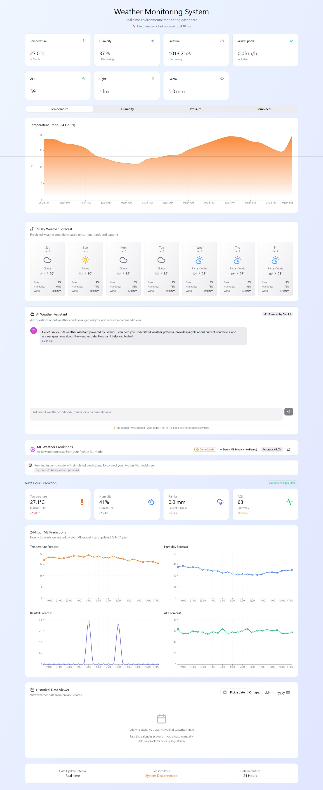

<div align="center">

# 🌤️ Weather Monitoring Web App

### *Real-time IoT Weather Monitoring with AI Intelligence*

<br/>



<br/>

[](https://reactjs.org/)
[](https://www.typescriptlang.org/)
[](https://firebase.google.com/)
[](https://deepmind.google/technologies/gemini/)
[](https://vitejs.dev/)
[](https://tailwindcss.com/)

<p align="center">
  <strong>A modern, real-time weather monitoring system featuring ESP32/Arduino IoT integration, AI-powered weather assistant with Google Gemini 2.0 Flash, and Firebase Realtime Database connectivity.</strong>
</p>

[🚀 Live Demo](#) • [📖 Documentation](#-configuration) • [🐛 Report Bug](https://github.com/SHARVIL45/weather-monitoring-webapp/issues) • [✨ Request Feature](https://github.com/SHARVIL45/weather-monitoring-webapp/issues)

</div>

---

## ✨ Features

<table>
<tr>
<td width="50%">

### 🌡️ Real-time Weather Monitoring
- **Live sensor data** from ESP32/Arduino via Firebase RTDB
- Real-time updates every second
- Temperature, humidity, pressure, wind speed monitoring
- Air Quality Index (AQI) tracking with sensor calibration
- Rain detection and light level monitoring
- Interactive charts with 48-point rolling history
- Connection status monitoring with auto-reconnect

</td>
<td width="50%">

### 🤖 AI Weather Assistant
- Powered by **Google Gemini 2.0 Flash**
- Context-aware weather analysis using live sensor data
- Personalized clothing recommendations
- Activity suggestions based on weather conditions
- Natural language conversations
- Weather pattern insights and explanations

</td>
</tr>
<tr>
<td width="50%">

### 🎨 Beautiful UI
- Modern gradient design with glassmorphism effects
- Fully responsive layout for all devices
- Smooth animations and transitions
- Animated area charts using Recharts
- Interactive dashboard with real-time updates
- Professional weather cards with status indicators

</td>
<td width="50%">

### 🔥 Firebase Integration
- Real-time database connectivity
- Dynamic CDN imports for Firebase SDK
- Connection status monitoring (30-second timeout)
- Automatic reconnection handling
- Historical data storage and retrieval
- Support for multiple sensor field names

</td>
</tr>
</table>

## 🚀 Quick Start

### Prerequisites

Before you begin, ensure you have the following installed:
- **Node.js** (v16 or higher) - [Download](https://nodejs.org/)
- **npm** or **yarn** package manager
- **Firebase account** - [Sign up](https://firebase.google.com/)
- **Google Gemini API key** - [Get API Key](https://makersuite.google.com/app/apikey)

### 📥 Installation

1. **Clone the repository**
   ```bash
   git clone https://github.com/SHARVIL45/weather-monitoring-webapp.git
   cd weather-monitoring-webapp
   ```

2. **Install dependencies**
   ```bash
   npm install
   ```

3. **Configure Firebase**
   
   Edit `src/firebase-config.ts` and add your Firebase project credentials:
   ```typescript
   const firebaseConfig = {
     apiKey: "YOUR_FIREBASE_API_KEY",
     authDomain: "YOUR_PROJECT_ID.firebaseapp.com",
     databaseURL: "https://YOUR_PROJECT_ID-default-rtdb.firebaseio.com",
     projectId: "YOUR_PROJECT_ID",
     storageBucket: "YOUR_PROJECT_ID.appspot.com",
     messagingSenderId: "YOUR_MESSAGING_SENDER_ID",
     appId: "YOUR_APP_ID"
   };
   ```

4. **Configure Gemini AI**
   
   Edit `src/components/WeatherAIAssistant.tsx` and add your API key:
   ```typescript
   const GEMINI_API_KEY = "YOUR_GEMINI_API_KEY";
   ```

5. **Start the development server**
   ```bash
   npm run dev
   ```

6. **Open your browser**
   
   Navigate to `http://localhost:5173` and enjoy! 🎉

## 📊 Firebase RTDB Structure

Your Firebase Realtime Database should have data at the `Weather` node with the following structure:

```json
{
  "Weather": {
    "temperature": 27.0,
    "humidity": 37,
    "pressure": 1013.2,
    "windSpeed": 0.0,
    "aqi": 59,
    "rainfall": 1.0,
    "light": 1,
    "rainDigital": 1,
    "ldrDigital": 1
  }
}
```

> **Note**: The app supports multiple field name variations (e.g., `Temperature`, `Temp`, `temperature_C`) for compatibility with different sensor configurations. AQI values are automatically calibrated by adding +50 to the sensor reading.

## 🔧 Configuration

### Firebase Setup
The app automatically connects to your Firebase RTDB at:
```
https://weather-monitoring-8b62f-default-rtdb.firebaseio.com/
```

To change the database URL, update `src/App.tsx`:
```typescript
const firebaseConfig = {
  databaseURL: "YOUR_FIREBASE_URL_HERE",
};
```

### Gemini AI Setup
Update your API key in `src/components/WeatherAIAssistant.tsx`:
```typescript
const GEMINI_API_KEY = "YOUR_API_KEY_HERE";
```

## 🛠️ Tech Stack

<div align="center">

| Category | Technologies |
|----------|-------------|
| **Frontend Framework** | React 18.3.1 with TypeScript |
| **Build Tool** | Vite 5.x |
| **Styling** | Tailwind CSS with custom gradients |
| **UI Components** | Custom components built with Radix UI primitives |
| **Charts & Visualization** | Recharts |
| **Icons** | Lucide React |
| **AI/ML** | Google Gemini 2.0 Flash API |
| **Real-time Database** | Firebase Realtime Database (RTDB) |
| **State Management** | React Hooks (useState, useEffect) |
| **Date/Time** | date-fns |
| **Animations** | CSS Transitions & Tailwind animate |

</div>

## 🎯 Features in Detail

### 📈 Weather Dashboard
- **6 Primary Metrics**: Temperature, Humidity, Pressure, Wind Speed, AQI, Light Level, Rainfall
- Real-time status indicators (Stable, Increasing, Decreasing)
- Connection status monitoring with visual feedback
- Last update timestamp
- System health monitoring

### 📊 Interactive Charts
- **Temperature Trend**: 24-hour rolling history with gradient fill
- **Humidity Levels**: Real-time humidity tracking
- **Atmospheric Pressure**: Pressure trends over time
- **Combined View**: Multi-parameter visualization
- Responsive design with tooltips

### 📅 Historical Data Viewer
- Calendar-based date picker
- 24-hour historical data display
- Sortable and filterable data table
- Export capabilities
- Automatic fallback to demonstration data

### 🌤️ 7-Day Weather Forecast
- Daily weather predictions
- Temperature ranges (High/Low)
- Weather conditions with icons
- Humidity and precipitation probability
- Hourly breakdown

### 💬 AI Weather Assistant
- Natural language interface
- Context-aware responses using live sensor data
- Personalized recommendations:
  - Clothing suggestions
  - Outdoor activity advice
  - Health alerts based on AQI
- Weather phenomenon explanations
- Beautiful gradient chat interface with animations

### 🔮 ML Weather Predictions
- Python-based machine learning models
- Next-hour temperature predictions
- Rainfall probability forecasts
- Integration with Firebase for data logging
- Accuracy metrics display

## 🔐 Security Notes

⚠️ **Important**: 
- Never commit API keys to version control
- Use environment variables for production
- Implement proper Firebase security rules
- Consider using a backend proxy for API calls in production

## 📄 Project Structure

```
├── src/
│   ├── components/
│   │   ├── ui/              # UI component library
│   │   ├── WeatherCard.tsx
│   │   ├── WeatherForecast.tsx
│   │   ├── WeatherAIAssistant.tsx
│   │   └── MLWeatherPrediction.tsx
│   ├── App.tsx              # Main application
│   ├── main.tsx             # Entry point
│   ├── firebase-config.ts   # Firebase configuration
│   └── index.css            # Global styles
├── public/                  # Static assets
├── package.json
├── tsconfig.json
├── vite.config.ts
└── README.md
```

## 🤝 Contributing

Contributions, issues, and feature requests are welcome! Feel free to check the [issues page](https://github.com/SHARVIL45/weather-monitoring-webapp/issues).

### How to Contribute

1. Fork the project
2. Create your feature branch (`git checkout -b feature/AmazingFeature`)
3. Commit your changes (`git commit -m 'Add some AmazingFeature'`)
4. Push to the branch (`git push origin feature/AmazingFeature`)
5. Open a Pull Request

## ⭐ Show your support

Give a ⭐️ if this project helped you!

## 📝 License

This project is [MIT](LICENSE) licensed.

## 👨‍💻 Author

**Sharvil**
- GitHub: [@SHARVIL45](https://github.com/SHARVIL45)
- Repository: [weather-monitoring-webapp](https://github.com/SHARVIL45/weather-monitoring-webapp)

## 🙏 Acknowledgments

- [Google Gemini AI](https://deepmind.google/technologies/gemini/) for intelligent weather assistance
- [Firebase](https://firebase.google.com/) for real-time database services
- [Radix UI](https://www.radix-ui.com/) for accessible component primitives
- [Tailwind CSS](https://tailwindcss.com/) for beautiful styling
- [Recharts](https://recharts.org/) for amazing data visualization
- [Lucide](https://lucide.dev/) for beautiful icons
- ESP32/Arduino community for IoT inspiration

## 📞 Support & Contact

If you have any questions, need help with setup, or want to report a bug:
- 🐛 [Open an issue](https://github.com/SHARVIL45/weather-monitoring-webapp/issues)
- 📧 Contact through GitHub

---

<div align="center">


**[⬆ Back to Top](#-weather-monitoring-web-app)**

</div>